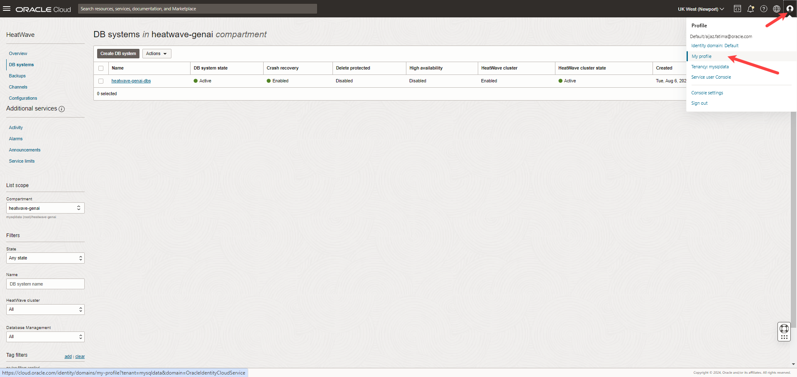

# Create DB System

## Introduction

In this lab you will connect to the DB system you created in Lab 2 from VS Code.

_Estimated Time:_ 15 minutes

### Objectives

In this lab, you will be guided through the following tasks:

- Connect to the OCI tenancy.
- Connect to the DB System.

### Prerequisites

- You have completed Lab 2.


## Task 1:  Connect to the OCI tenancy

Before you can get started, you must set up a DB Connection to the HeatWave instance on the Oracle Cloud Infrastructure (OCI). This has to be done once since MySQL Shell for VS Code will store all registered DB connections.

1. Log into the [OCI Console](https://www.oracle.com/cloud/sign-in.html?redirect_uri=https%3A%2F%2Fcloud.oracle.com%2F).

2. Enter your **Cloud Account Name** and click **Next**. 
    
    

3. Select **Default** as the identity domain.

    

4. Enter your **Username** and **Password** and click **Sign In**.

    

5. Click **Profile** and select **My Profile**.

    

6.	Under **Resources**, click **API keys**, and click **Add API key**.

7. Click **Download private key**.
    
    1. Store the API key in a .oci folder inside your home directory.

    2. Rename the API key to oci_api_key.pem.

    3. Click **Add**.
    
    

8. Copy the configuration file text and switch to VS Code.

    

9. In VS Code, select the **MySQL Shell for VS Code** extension.

10. Click **Configure the OCI Profile List** in the **ORACLE CLOUD INFRASTRUCTURE** view, and paste the configuration file text into the config file.

    - Rename the top section from [DEFAULT] to the name of the tenancy, [TenancyName]
    
    - Update the path to the API Key you had stored in your home directory.

    

11. Close the file and reload the **ORACLE CLOUD INFRASTRUCTURE** view. You can browse the resources of your OCI tenancy.

    


## Task 2: Connect to the DB System

1. Browse to the DB system, **heatwave-genai-dbs**, and right click and select **Create Connection with Bastion Service**.

    

2. Click **Create New Bastion**.

    

3. In the **Database Connection Configuration** dialog, enter the **User Name** and click **Store Password** to enter the password of your DB system.

    

4. Click **OK** to create the connection. 

5. Click **Open New Database Connection** icon to connect to the DB system. 

    

6. Check whether you are connected to the DB system by running the following command:

    ```bash
    show databases;
    ```

    

You may now **proceed to the next lab**.

## Learn More

- [HeatWave User Guide](https://dev.mysql.com/doc/heatwave/en/)

- [HeatWave on OCI User Guide](https://docs.oracle.com/en-us/iaas/mysql-database/index.html)

- [MySQL Documentation](https://dev.mysql.com/)

## Acknowledgements

- **Author** - Aijaz Fatima, Product Manager
- **Contributors** - Mandy Pang, Senior Principal Product Manager
- **Last Updated By/Date** - Aijaz Fatima, Product Manager, August 2024