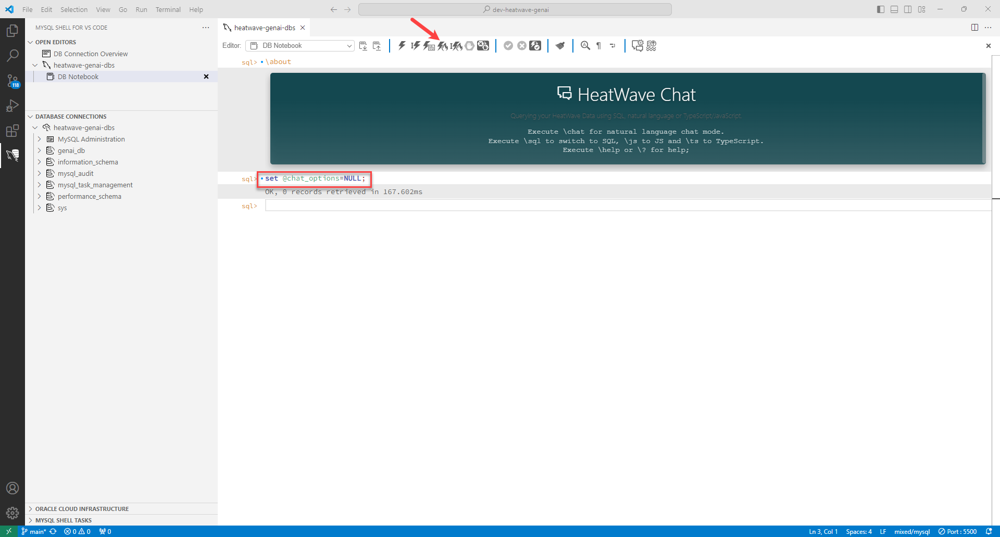
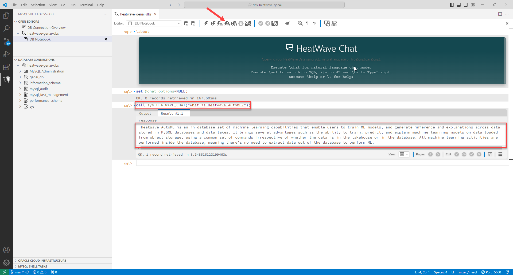
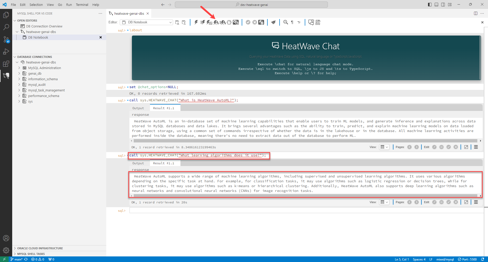
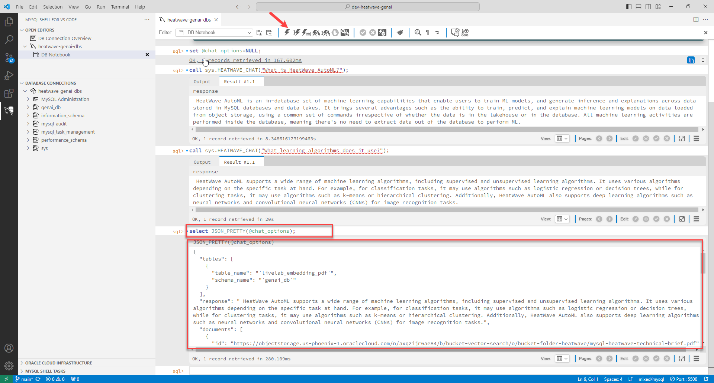

# Run HeatWave Chat 

## Introduction

HeatWave Chat is a conversational agent that utilizes large language models (LLMs) to understand inputs and responds in natural manner. It extends the text generation by using a chat history that lets you ask follow-up questions, and uses the vector search functionality to draw its knowledge from the inbuilt vector store. The responses generated by HeatWave Chat are quick and secure as all the communication and processing happens within the HeatWave service.

By default, HeatWave Chat searches for an answer to a query across all ingested documents by automatically discovering available vector stores, and returns the answer along with relevant citations. However, you limit the scope of search to specific document collections either certain vector stores or documents to include in the search. 
If you do not have a vector store set up, then HeatWave Chat uses information available in public data sources to generate a response for your query.

_Estimated Time:_ 30 minutes

### Objectives

In this lab, you will be guided through the following task:

- Run HeatWave Chat.
- View HeatWave Chat session details.

### Prerequisites

- Must complete Lab 4.

## Task 1: Run HeatWave Chat


1. Reset the @chat_options session variable:

    ```bash
   <copy>set @chat_options=NULL;</copy>
    ```

    

2. Add your question to HeatWave Chat. 

    ```bash
    <copy>call sys.HEATWAVE_CHAT("YourQuestion");</copy>
    ```
    
    For example:

    ```bash
    <copy>call sys.HEATWAVE_CHAT("What is HeatWave AutoML?");</copy>
    ```

    

3. Ask follow-up questions.

    ```bash
    <copy>call sys.HEATWAVE_CHAT("What learning algorithms does it use?");</copy>
    ```

    


## Task 2: View HeatWave Chat session details

 1. Inspect the session variable:

     ```bash
    <copy>select JSON_PRETTY(@chat_options);</copy>
    ```

    

 2. The output includes the following details about a chat session:

    - Vector store tables: in the database which were referenced by HeatWave Chat.

    - Text segments: that were retrieved from the vector store and used as context to prepare responses for your queries.

    - Chat history: which includes both your queries and responses generated by HeatWave Chat.

    - LLM model details: which was used by the routine to generate the responses..

    

## Learn More

- [HeatWave User Guide](https://dev.mysql.com/doc/heatwave/en/)

- [HeatWave on OCI User Guide](https://docs.oracle.com/en-us/iaas/mysql-database/index.html)

- [MySQL Documentation](https://dev.mysql.com/)


## Acknowledgements

- **Author** - Aijaz Fatima, Product Manager
- **Contributors** - Mandy Pang, Senior Principal Product Manager, Aijaz Fatima, Product Manager
- **Last Updated By/Date** - Aijaz Fatima, Product Manager, August 2024