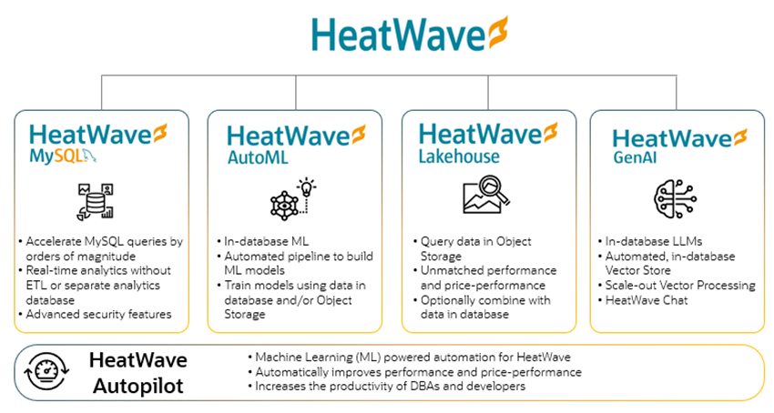

# Introduction

HeatWave GenAI is the industry's first automated in-database Generative AI service. HeatWave GenAI is unique because it seamlessly integrates large language models (LLMs) and embedding generation within the database, eliminating the need for external services. This integration enhances performance and security, simplifies application complexity, and reduces costs as it runs on CPUs. HeatWave GenAI integrates seamlessly with other in-database HeatWave capabilities such as machine learning, analytics, and Lakehouse, opening up a new class of applications and providing higher-quality responses. With HeatWave GenAI, you can effortlessly generate new and realistic content, speed up manual or repetitive tasks like summarizing large documents, and engage in natural language interactions.

## About this Workshop

In this LiveLab, you will connect to a HeatWave DB System. Subsequently, you will use HeatWave GenAI to generate content in natural language and perform vector search on your enterprise data.

_Estimated Time:_ 1.5 hours

## About Product/Technology

HeatWave is a fully managed cloud service that enables organizations to efficiently run analytics, transaction processing, machine learning, and generative AI using a single service without the need for ETL. Its scale-out architecture is designed to process data stored in Object Storage and MySQL databases, delivering industry-leading performance and price-performance. HeatWave can process structured, semi-structured, and unstructured data in Object Storage. It provides the capability to create a vector store from Object Storage files and enables enterprises to utilize LLMs and generative AI on their internal content. This opens the door to a new class of applications built with HeatWave, including the ability to interact with HeatWave using natural language. HeatWave is available on OCI, AWS, and Azure.

The following diagram illustrates HeatWave components at a glance.

## Objectives

In this lab, you will be guided through the following steps:

1. Setup MySQL Shell for Visual Studio Code
2. Create a DB system
3. Connect to the DB System from VS Code
4. Generate content
5. Perform a vector search

## Prerequisites

Please make sure you can sign in to your HeatWave OCI Cloud Account. See [Sign Up](https://dev.mysql.com/doc/heatwave-aws/en/heatwave-aws-sign-procedure.html).

## Learn More

- [HeatWave User Guide](https://dev.mysql.com/doc/heatwave/en/)

- [HeatWave on OCI User Guide](https://docs.oracle.com/en-us/iaas/mysql-database/index.html)

- [MySQL Documentation](https://dev.mysql.com/)

## Acknowledgements

- **Author** - Aijaz Fatima, Product Manager
- **Contributors** - Mandy Pang, Senior Principal Product Manager
- **Last Updated By/Date** - Aijaz Fatima, Product Manager, August 2024
