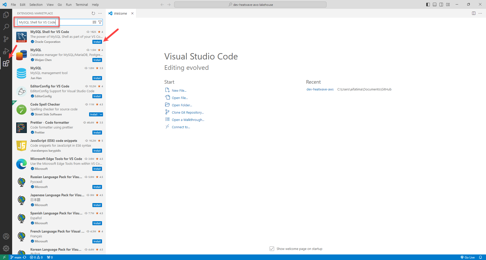

# Setup MySQL Shell for Visual Studio Code

## Introduction

In this lab you will setup MySQL Shell for Visual Studio Code.

_Estimated Time:_ 15 minutes

### Objectives

In this lab, you will be guided through the following tasks:

- Setup MySQL Shell for Visual Studio Code.

### Prerequisites

- Visual Studio Code is installed. If you do not have it installed, download and install from [here](https://code.visualstudio.com/download).

## Task 1: Setup MySQL Shell for Visual Studio Code

1. Launch **Visual Studio Code**.

2. Click **Extensions** and search for **MySQL Shell for VS Code**.

3. Click **Install**.
    

4. After MySQL Shell for VS Code is installed, you can see the following icon:
    

You may now **proceed to the next lab**.

## Learn More

- [HeatWave User Guide](https://dev.mysql.com/doc/heatwave/en/)

- [HeatWave on OCI User Guide](https://docs.oracle.com/en-us/iaas/mysql-database/index.html)

- [MySQL Documentation](https://dev.mysql.com/)

## Acknowledgements

- **Author** - Aijaz Fatima, Product Manager
- **Contributors** - Mandy Pang, Senior Principal Product Manager, Aijaz Fatima, Product Manager
- **Last Updated By/Date** - Aijaz Fatima, Product Manager, August 2024