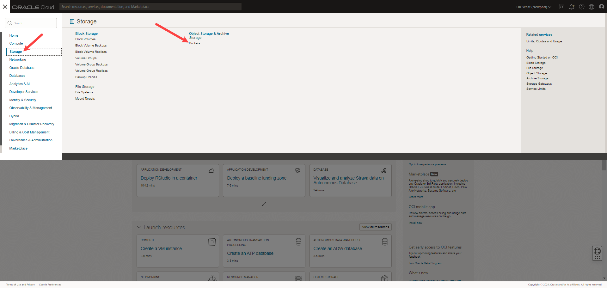
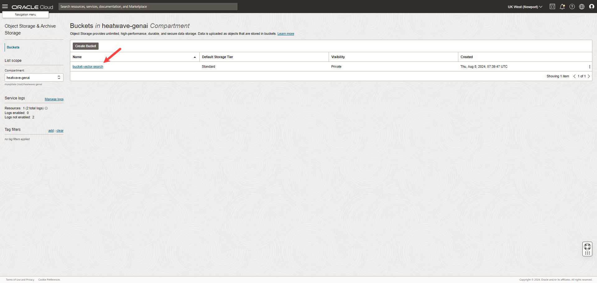
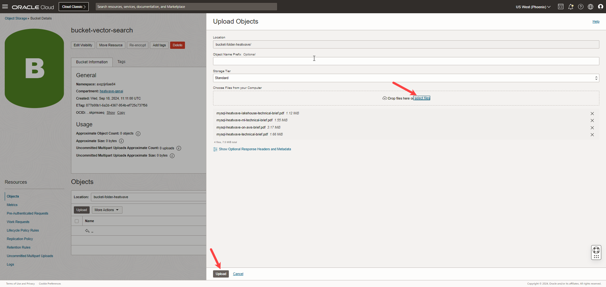
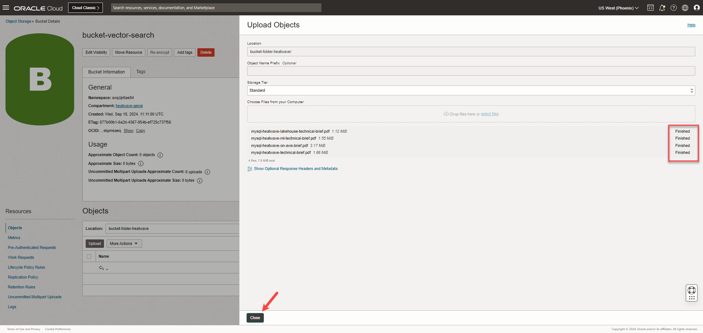
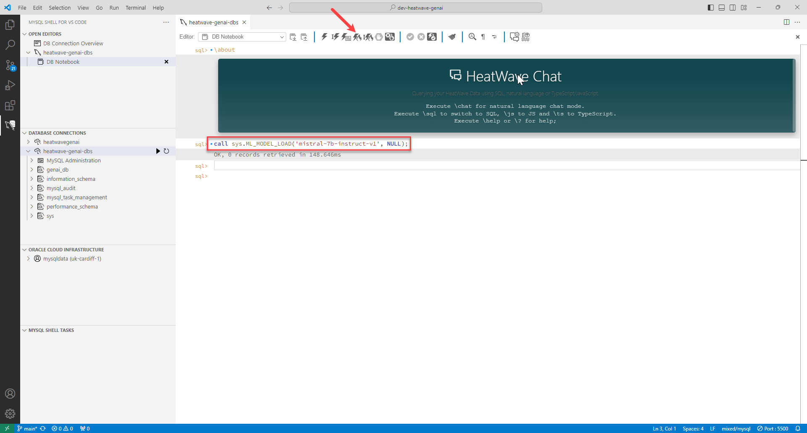
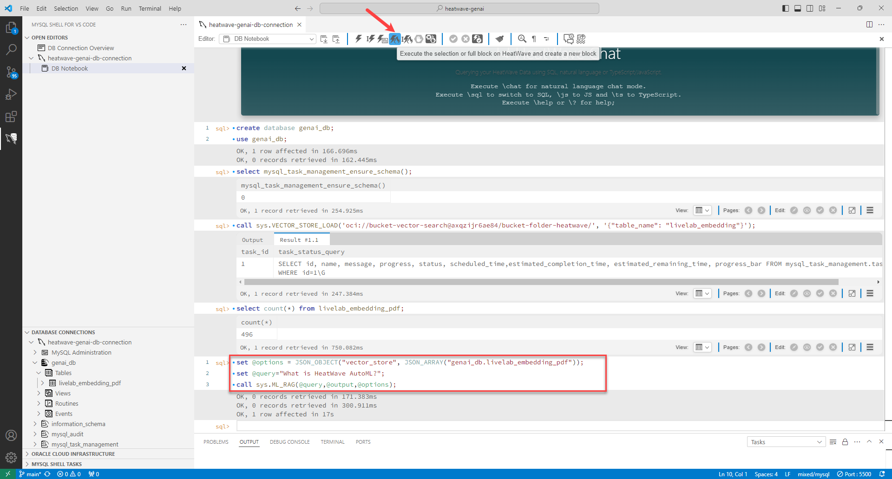

# Perform a Vector Search

## Introduction

Using the in-built vector store and retrieval-augmented generation (RAG), you can load and query unstructured documents stored in Object Storage using natural language within the HeatWave ecosystem.

_Estimated Time:_ 10 minutes

### Objectives

In this lab, you will be guided through the following task:

- Create a bucket.
- Upload files to the bucket.
- Create a Pre-Authenticated Request.
- Set up a vector store.
- Perform a vector search.

### Prerequisites

- Must complete Lab 4.

## Task 1: Create a bucket

The Object Storage service provides reliable, secure, and scalable object storage. Object Storage uses buckets to organize your files. 

1. Open the **Navigation menu** and click **Storage**. Under **Object Storage & Archive Storage**, click **Buckets**.

    

2. In the **heatwave-genai** compartment, click **Create Bucket**. 

    

3. Enter the **Bucket Name**, accept the defaults for the rest of the fields, and click **Create**.

    

4. A bucket is created.

    

## Task 2: Upload files to the bucket

1.  In the **Object Storage & Archive Storage** page, click the bucket name to view its details.

    

2. Under **Objects**, click **Upload**.

    

3. Click **select files** to display a file selection dialog box, and select the files you want to perform a vector search on, and click **Upload**.

    

4. When the file status shows **Finished**, click **Close** to return to the bucket.

    

## Task 3: Create a Pre-Authenticated Request

Pre-authenticated requests provide a way to let you access a bucket or an object without having your own credentials.

1. In the **Bucket Details** page, under **Resources**, click **Pre-Authenticated Request**, and then click **Create Pre-Authenticated Request**.

    

2. In the **Create Pre-Authenticated Request** dialog box, enter the **Name**, ensure **Bucket** is selected, and click **Create Pre-Authenticated Request**. You can choose to increase the **Expiration** date of the Pre-Authenticated Request.

    

3. Copy the URL that appears in the **Pre-Authenticated Request Details** dialog box, paste the URL somewhere in durable storage for future reference, and click **Close**.

    


## Task 4: Set up a vector store

1. Create a new schema and select it. You can also select any existing schema.

    ```bash
    <copy>create database genai_db;</copy>
	<copy>use genai_db;</copy>
    ```

    

2. Call the following procedure to create a schema that is used for task management.

    ```bash
    <copy>select mysql_task_management_ensure_schema();</copy>
    ```

    

3. Click **Reload Database Information** to view the mysql\_task\_management schema.

    

4. Ingest the file from the Object Storage, create vector embeddings, and load the vector embeddings into HeatWave:

    ```bash
    <copy>call sys.VECTOR_STORE_LOAD('<PAR>', '{"table_name": "<EmbeddingsTableName>"}');</copy>
    ```
    Replace the following:

    - PAR: Pre-Authenticated Request of the bucket, which you had copied in Task 3.
    - EmbeddingsTableName: The name you want for the vector embeddings table.

    For example:

    ```bash
    <copy>call sys.VECTOR_STORE_LOAD('https://axoumfbmk7ld.objectstorage.uk-cardiff-1.oci.customer-oci.com/p/XKR6gUuquT8bSL-ftu89F58FTblCr8QcoN5JcuUzpVE8FqQZ5kgEvr1WR-a5lIYv/n/axoumfbmk7ld/b/bucket-vector-search/o/', '{"table_name": "livelab_embedding"}');</copy>
    ```

    

5. Verify that embeddings are loaded in the vector embeddings table:

    ```bash
    <copy>select count(*) from <EmbeddingsTableName>;</copy>
    ```
    For example:
    ```bash
    <copy>select count(*) from livelab_embedding; </copy>
    ```

If you see a numerical value in the output, your embeddings are successfully loaded in the table.

## Task 5: Perform a vector search

HeatWave retrieves content from the vector store and provide that as context to the LLM. This process is called as retrieval-augmented generation or RAG. This helps the LLM to produce more relevant and accurate results for your queries.

1. Load the LLM in HeatWave.

    ```bash
    <copy>call sys.ML_MODEL_LOAD('LLMModel', NULL);</copy>
    ```

    Replace LLMModel with the name of the LLM model that you want to use. The available models are: mistral-7b-instruct-v1 and llama2-7b-v1.

    For example:

    ```bash
    <copy>call sys.ML_MODEL_LOAD('mistral-7b-instruct-v1', NULL);</copy>
    ```

    

2. Set the @options session variable to specify the table for retrieving the vector embeddings.

    ```bash
    <copy>set @options = JSON_OBJECT("vector_store", JSON_ARRAY("<DBName>.<EmbeddingsTableName>"));</copy>
    ```

    For example:

    ```bash
    <copy>set @options = JSON_OBJECT("vector_store", JSON_ARRAY("genai_db.livelab_embedding"));</copy>
    ```

3. Set the session @query variable to define your natural language query.

    ```bash
    <copy>set @query="<AddYourQuery>";</copy>
    ```
    
    Replace AddYourQuery with your natural language query.

    For example:

    ```bash
    <copy>set @query="What is HeatWave AutoML?";</copy>
    ```

    


4. Retrieve the augmented prompt, use the ML_RAG routine.

    ```bash
    <copy>call sys.ML_RAG(@query,@output,@options);</copy>
    ```

5. Print the output:

    ```bash
    <copy>select JSON_PRETTY(@output);</copy>
    ```
    
    Text-based content that is generated by the LLM in response to your query is printed as output. The output generated by RAG is comprised of two parts:

    - The text section contains the text-based content generated by the LLM as a response for your query.

    - The citations section shows the segments and documents it referred to as context.

The output looks similar to the following:

```bash
"text": " AutoML is a machine learning technique that automates the process
of selecting, training, and evaluating machine learning models. It involves
using algorithms and techniques to automatically identify the best model
for a given dataset and optimize its hyperparameters without requiring manual
intervention from data analysts or ML practitioners. AutoML can be used in
various stages of the machine learning pipeline, including data preprocessing,
feature engineering, model selection, hyperparameter tuning,
and model evaluation.",
"citations": [
  {
    "segment": "Oracle AutoML also produces high quality models very efficiently,
    which is achieved through a scalable design and intelligent choices that
    reduce trials at each stage in the pipeline.\n Scalable design: The Oracle
    AutoML pipeline is able to exploit both HeatWave internode and intranode
    parallelism, which improves scalability and reduces runtime.",
    "distance": 0.4262576103210449,
    "document_name": "https://objectstorage.Region.oraclecloud.com/n/Namespace/b/BucketName/o/Path/Filename"
  },
  {
    "segment": "The HeatWave AutoML ML_TRAIN routine leverages Oracle AutoML
    technology to automate the process of training a machine learning model.
    Oracle AutoML replaces the laborious and time consuming tasks of the data
    analyst whose workflow is as follows:\n1. Selecting a model from a large
    number of viable candidate models.\n2.\n99",
    "distance": 0.4311879277229309,
    "document_name": " https://objectstorage. Region.oraclecloud.com/n/Namespace/b/BucketName/o/Path/Filename"
  },
  {
    "segment": "3.1 HeatWave AutoML Features HeatWave AutoML makes it easy to
    use machine learning, whether you are a novice user or an experienced ML
    practitioner. You provide the data, and HeatWave AutoML analyzes the
    characteristics of the data and creates an optimized machine learning model
    that you can use to generate predictions and explanations.",
    "distance": 0.4441382884979248,
    "document_name": "https://objectstorage. Region.oraclecloud.com/n/Namespace/b/BucketName/o/Path/Filename"
  }
],
"vector_store": [
  "demo_db.demo_embeddings"
]
```
## Learn More

- [HeatWave User Guide](https://dev.mysql.com/doc/heatwave/en/)

- [HeatWave on OCI User Guide](https://docs.oracle.com/en-us/iaas/mysql-database/index.html)

- [MySQL Documentation](https://dev.mysql.com/)


## Acknowledgements

- **Author** - Aijaz Fatima, Product Manager
- **Contributors** - Mandy Pang, Senior Principal Product Manager, Aijaz Fatima, Product Manager
- **Last Updated By/Date** - Aijaz Fatima, Product Manager, August 2024